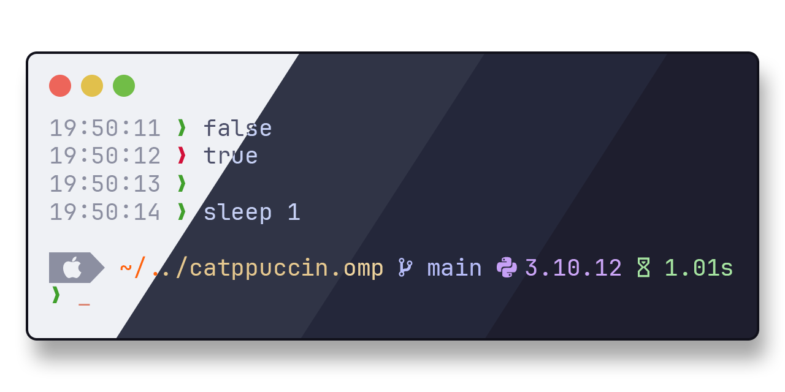
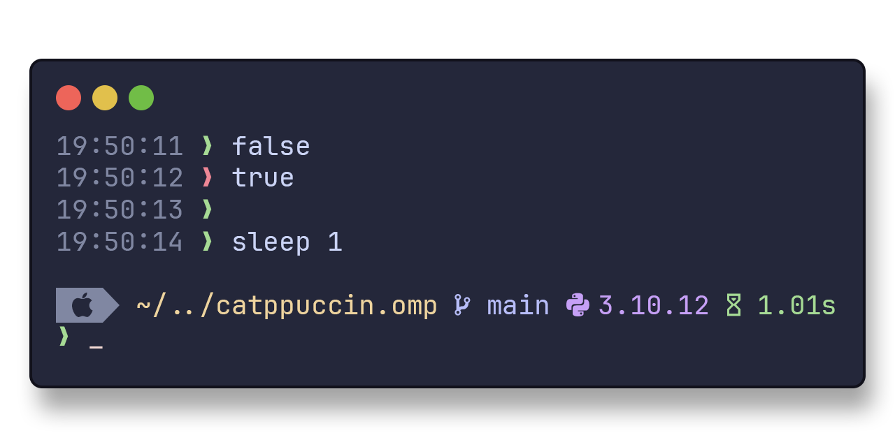

<h3 align="center">
<br/>

 Catppuccin for <a href="https://ohmyposh.dev/">Oh My Posh</a>

</h3>

<p align="center">

</p>

## Previews

<details>
<summary>🌻 Latte</summary>

</details>
<details>
<summary>🪴 Frappé</summary>

</details>
<details>
<summary>🌺 Macchiato</summary>

</details>
<details>
<summary>🌿 Mocha</summary>

</details>

## Usage

It is assumed that you already have Oh My Posh installed as per its [documentation](https://ohmyposh.dev/docs) and that your terminal uses a [Nerd font](https://www.nerdfonts.com/). It is recommended that you use the relevant catppuccin flavour for your terminal so that it matches the prompt; see [this list](https://github.com/catppuccin/catppuccin#-ports-and-more) under `🌱 Terminals`.

<details>
<summary>bash</summary>

Adjust the Oh My Posh init line in `~/.bashrc` (could be `~/.profile` or `~/.bash_profile` depending on your environment) by adding the `--config` flag with the catppuccin flavor of your choice. For example the mocha flavor:

```shell
eval "$(oh-my-posh init bash --config 'https://raw.githubusercontent.com/maxstolly/catppuccin.omp/main/mocha.omp.json')"
```

Once altered, reload your profile for the changes to take effect:

```shell
exec bash
```

</details>
<details>
<summary>cmd</summary>

Adjust the Oh My Posh init line in `oh-my-posh.lua` by adding the `--config` flag with the catppuccin flavor of your choice. For example the mocha flavor:

```lua
load(io.popen('oh-my-posh init cmd --config "https://raw.githubusercontent.com/maxstolly/catppuccin.omp/main/mocha.omp.json"'):read("*a"))()
```

Once altered, restart cmd for the changes to take effect.

</details>
<details>
<summary>elvish</summary>

Adjust the Oh My Posh init line in `~/.elvish/rc.elv` by adding the `--config` flag with the catppuccin flavor of your choice. For example the mocha flavor:

```elvish
eval (oh-my-posh init elvish --config 'https://raw.githubusercontent.com/maxstolly/catppuccin.omp/main/mocha.omp.json')
```

Once added, reload your profile for the changes to take effect:

```elvish
exec elvish
```

</details>
<details>
<summary>fish</summary>

Adjust the Oh My Posh init line in `~/.config/fish/config.fish` by adding the `--config` flag with the catppuccin flavor of your choice. For example the mocha flavor:

```fish
oh-my-posh init fish --config 'https://raw.githubusercontent.com/maxstolly/catppuccin.omp/main/mocha.omp.json' | source
```

Once altered, reload your config for the changes to take effect:

```fish
. ~/.config/fish/config.fish
```

</details>
<details>
<summary>nushell</summary>

Adjust the Oh My Posh init line in Nushell env file (`$nu.env-path`) by adding the `--config` flag with the catppuccin flavor of your choice. For example the mocha flavor:

```nushell
oh-my-posh init nu --config 'https://raw.githubusercontent.com/maxstolly/catppuccin.omp/main/mocha.omp.json'
```

This saves the initialization script to `~/.oh-my-posh.nu`. Now, edit the Nushell config file (`$nu.config-path`) and add the following line at the bottom:

```nushell
source ~/.oh-my-posh.nu
```

If you want to save the initialization script elsewhere, you can change the first line to something like this:

```nushell
oh-my-posh init nu --config 'https://raw.githubusercontent.com/maxstolly/catppuccin.omp/main/mocha.omp.json' --print | save /mylocation/myscript.nu --force
```

And change the `source` line to:

```nushell
source /mylocation/myscript.nu
```

</details>
<details>
<summary>powershell</summary>

Adjust the Oh My Posh init line in your `$PROFILE` by adding the `--config` flag with the catppuccin flavor of your choice. For example the mocha flavor:

```powershell
oh-my-posh init pwsh --config 'https://raw.githubusercontent.com/maxstolly/catppuccin.omp/main/mocha.omp.json' | Invoke-Expression
```

Once altered, reload your profile for the changes to take effect:

```powershell
. $PROFILE
```

When the above command gives an error, make sure to create the profile first and add the `oh-my-posh init` above.

```powershell
New-Item -Path $PROFILE -Type File -Force
```

In this scenario, it can also be that PowerShell blocks running local scripts. To solve that, set PowerShell to only require remote scripts to be signed using `Set-ExecutionPolicy RemoteSigned`, or [sign the profile](https://learn.microsoft.com/en-us/powershell/module/microsoft.powershell.core/about/about_signing?view=powershell-7.3#methods-of-signing-scripts).

</details>
<details>
<summary>tcsh</summary>

Adjust the Oh My Posh init line in `~/.tcshrc` by adding the `--config` flag with the catppuccin flavor of your choice. For example the mocha flavor:

```tcsh
eval `oh-my-posh init tcsh --config 'https://raw.githubusercontent.com/maxstolly/catppuccin.omp/main/mocha.omp.json'`
```

Once added, reload your profile for the changes to take effect:

```tcsh
exec tcsh
```

</details>
<details>
<summary>xonsh</summary>

Adjust the Oh My Posh init line in `~/.xonshrc` by adding the `--config` flag with the catppuccin flavor of your choice. For example the mocha flavor:

```xonsh
execx($(oh-my-posh init xonsh --config 'https://raw.githubusercontent.com/maxstolly/catppuccin.omp/main/mocha.omp.json'))
```

Once added, reload your profile for the changes to take effect:

```xonsh
exec xonsh
```

</details>
<details>
<summary>zsh</summary>

Adjust the Oh My Posh init line in `~/.zshrc` by adding the `--config` flag with the catppuccin flavor of your choice. For example the mocha flavor:

```shell
eval "$(oh-my-posh init zsh --config 'https://raw.githubusercontent.com/maxstolly/catppuccin.omp/main/mocha.omp.json')"
```

Once added, reload your profile for the changes to take effect:

```shell
exec zsh
```

</details>

## Customization

Feel free to customize this theme to your own liking by either cloning the repository or with `oh-my-posh config export --output ~/mytheme.omp.json`. If you find a bug or think a feature should be included, do not hesitate to make a pull request or issue. See the [Oh My Posh documentation](https://ohmyposh.dev/docs/configuration/general) on how to configure a theme.

&nbsp;

<p align="center">

</p>

<p align="center">
Copyright &copy; 2021-present <a href="https://github.com/catppuccin" target="_blank">Catppuccin Org</a>
</p>

<p align="center">
<a href="https://github.com/catppuccin/catppuccin/blob/main/LICENSE"></a>
</p>
